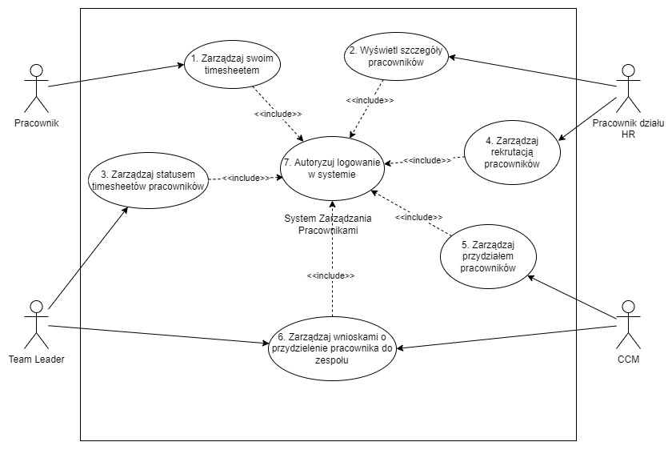

# System Zarządzania Pracownikami (SZP)
## Opis słowny
Firma „ITex” zajmuje się zarządzaniem zasobami ludzkimi w celu dostarczenia klientom usług z zakresu tworzenia aplikacji internetowych i mobilnych. Jednostka zarządzająca potrzebuje systemu do rozdysponowywania i pozyskiwania nowych zasobów ludzkich (pracowników). System ten będzie obsługiwany przez uprawnione i wyszkolone w tym celu osoby.  
W momencie przydzielenia Team Liderowi projektu, lub gdy w aktualnym projekcie zarządzanym przez Team Lidera jest niewystarczająca ilość wyspecjalizowanych pracowników, przez co nie są oni w stanie dostarczyć funkcjonalności określonych w sprincie, może on wnioskować o przydzielenie do zespołu nowego pracownika. W przypadku dostępności odpowiednich pracowników CCM przydziela ich do drużyny Team Lidera, który takowy wniosek złożył.  W sytuacji gdy istnieje deficyt pracowników z wymaganym skillsetem CCM przekazuje wniosek do działu HR. Pracownik działu HR ogłasza rekrutację programistów, a w ogłoszeniu specyfikuje wymagane umiejętności na określone stanowisko pracy. W przypadku rozstrzygnięcia wstępnego procesu rekrutacji lista kandydatów zostaje przesłana do CCM, który wspólnie z Team Leaderem podejmuje decyzję, który z kandydatów najlepiej uzupełni braki w drużynie. Osoba zatrudniona jako Pracownik otrzymuje konto pracownika zarejestrowane na jego dane podane podczas procesu rekrutacji.  
Pracownik w momencie zakończenia każdego dnia roboczego ma obowiązek uzupełnienia swojego timesheetu o przepracowane przez niego godziny wraz z opisem wykonanych zadań. W ostatnim tygodniu każdego miesiąca Team Leader ma obowiązek zweryfikowania uzupełnionych przez każdego podległego mu pracownika dnia roboczego i podjęcia decyzji, czy wykonane przez niego zadania są adekwatne do przepracowanego przez niego czasu. W momencie podjęcia decyzji zatwierdza lub odrzuca on dany dzień roboczy poprzez ustalenie statusu „Zatwierdzony” lub „Odrzucony”. Następnie pracownik działu HR do końca pierwszego tygodnia następnego okresu rozliczeniowego dokonuje wypłaty należności na powiązane z pracownikami konta bankowe.
## Aktorzy
1. **CCM** - Competence Center Manager, osoba odpowiedzialna za określone kompetencje w firmie. Ma administracyjne prawo do zarządzania Team Liderami. Może również przydzielać wolnych pracowników do zespołów.
2. **HR** - Human Resources, oddział zajmujący się rekrutacją nowych pracowników w zależności od zapotrzebowania wśród Team Liderów.
3. **Pracownik** – jednostka przydzielona do zespołu, zajmująca się wykonywaniem zadań rozdysponowanych przez Team Lidera.
4. **Team Leader** - Przywódca drużyny, zwierzchnik pracowników, ma administracyjne prawo do zatwierdzania lub odrzucania godzin pracy swoich podopiecznych. Może wnioskować o przydzielenie nowych pracowników do zespołu (złożyć wniosek o zapotrzebowanie).
## Słownik pojęć systemowych
1. **Drużyna** – grupa pracowników zarządzana przez Team Lidera.
2. **Dzień Roboczy** – numer kalendarzowy dnia, liczba przepracowanych przez pracownika godzin, szczegółowy opis wykonanych zadań oraz aktualny status (czy wykonane zadania zostały zatwierdzone przez Team Lidera).
3. **Konto Bankowe** – dane potrzebne do wykonania przelewu za wykonane przez pracownika usługi.
4. **Skillset** – zbiór umiejętności posiadanych przez pracownika.
5. **Sprint** – tygodniowy lub dwutygodniowy (w zależności od wcześniejszych ustaleń) termin dostarczenia działających funkcjonalności systemu.
6. **Timesheet** – rok, miesiąc oraz lista dni roboczych w danym miesiącu wraz ze stawką godzinową.
## Diagram Przypadków Użycia

## Przypadki Użycia
1. **Zarządzaj swoim timesheetem** – pracownik ma możliwość uzupełnienia swojego timesheetu o godziny pracy wraz z opisem wykonywanych przez siebie zadań.
2. **Wyświetl szczegóły pracowników** – pracownik działu HR ma możliwość wyświetlenia szczegółowych danych pracownika, które są mu potrzebne podczas wykonywania przelewu.
3. **Zarządzaj statusem timesheetów pracowników** – Team Leader ma możliwość wyświetlenia szczegółów timesheetów podległych mu pracowników oraz obowiązek zatwierdzenia lub odrzucenia dni roboczych uzupełnionych przez danego pracownika.
4. **Zarządzaj rekrutacją pracowników** – pracownik działu HR może ogłosić rekrutację nowych pracowników spełniających określone przez niego kryteria, posiadających pożądane umiejętności.
5. **Zarządzaj przydziałem pracowników** – CCM ma możliwość przydzielenia do drużyny Team Leadera nowego pracownika.
6. **Zarządzaj wnioskami o przydzielenie pracownika do zespołu** – Team Leader może złożyć wniosek o przydzielenie nowego pracownika do zespołu. CCM ma możliwość podglądu wniosków o przydzielenie pracownika do zespołu, a w przypadku braku odpowiednio wykwalifikowanych pracowników przekazuje wniosek do działu HR.
7. **Autoryzuj logowanie w systemie** – autoryzacja obejmuje sprawdzenie czy użytkownik systemu jest zalogowany. Zalogowany użytkownik w zależności od roli przydzielonej do konta ma dostęp do odpowiednich funkcjonalności. W systemie rozróżniane są 4 typy zalogowanych użytkowników: Pracownik, Team Leader, CCM i pracownik działu HR.
